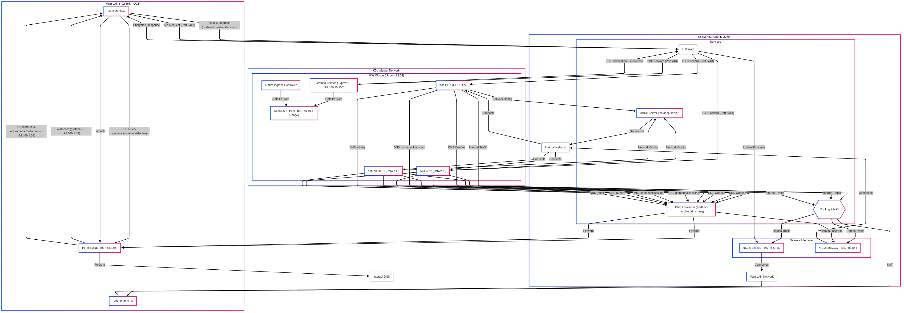

# K3s Ubuntu Lab Setup

This repository details the setup for a highly available K3s Kubernetes cluster running on Ubuntu 22.04 VMs within a home lab environment. The goal is to create a functional and somewhat enterprise-like Kubernetes setup for learning and experimentation, integrating with existing services like Pi-hole, Harbor, and GitLab.

## Architecture Overview

The core of this setup involves a dedicated service VM (`k8-svc`) acting as a router, DHCP server, DNS forwarder, NFS server, and HAProxy load balancer for a separate internal network (`192.168.10.0/24`) where the K3s nodes reside. This isolates the cluster while allowing controlled access from the main LAN (`192.168.1.0/24`).

## Key Components & Goals

*   **Service VM (`k8-svc`):** Ubuntu 22.04 VM providing essential network services.
    *   **Routing/NAT:** Connects the internal K3s network (`192.168.10.0/24`) to the main LAN (`192.168.1.0/24`) and the internet.
    *   **DHCP:** `isc-dhcp-server` provides static IP leases to K3s nodes.
    *   **DNS Forwarding:** `systemd-resolved` listens on the internal network and forwards DNS queries to an upstream Pi-hole (`192.168.1.53`).
    *   **Load Balancing:** `HAProxy` exposes the K3s API (port 6443) and application ingress (ports 80/443) to the main LAN via the `k8-svc` LAN IP (`192.168.1.89`).
    *   **Persistent Storage:** `nfs-kernel-server` provides NFS shares for Kubernetes PersistentVolumes.
*   **K3s Cluster:**
    *   **Control Plane:** Highly available setup with 2 control plane nodes using embedded etcd.
    *   **Workers:** 1+ worker nodes.
    *   **Network:** Uses default Flannel CNI within the `192.168.10.0/24` network.
    *   **Load Balancer Services:** `MetalLB` provides `LoadBalancer` type services using IPs from the internal network range (`192.168.10.100-192.168.10.150`).
    *   **Ingress:** The default Traefik Ingress controller will be disabled during K3s installation (`--disable traefik`). Nginx Ingress Controller will be installed and used instead.
    *   **Storage Provisioning:** `nfs-subdir-external-provisioner` dynamically creates PVs on the `k8-svc` NFS share.
*   **DNS & Certificates:**
    *   Uses Pi-hole (`192.168.1.53`) for main LAN DNS resolution.
    *   Uses custom certificates generated for the `komebacklabs.lan` domain, managed via Kubernetes TLS secrets and the Nginx Ingress Controller.
*   **Integration:** Aims to integrate with existing Harbor (`192.168.1.98`) and GitLab (`192.168.1.102`) instances.

## Setup Guides

Detailed step-by-step instructions can be found in the following files:

1.  **Overview:** [`k3s-lab-overview.md`](./k3s-lab-overview.md) - High-level goals and component summary.
2.  **Setup Guide Part 1 (k8-svc & Core Services):** [`k3s-ubuntu-lab/setup_guide-01.md`](./k3s-ubuntu-lab/setup_guide-01.md) - Covers `k8-svc` networking, DHCP, DNS, HAProxy.
3.  **Setup Guide Part 2 (K3s, MetalLB, NFS, App):** [`k3s-ubuntu-lab/setup_guide.md`](./k3s-ubuntu-lab/setup_guide.md) - Covers K3s installation, MetalLB, NFS storage, and sample application deployment. *(Note: This file currently contains the full guide content, including parts covered in `setup_guide-01.md`)*

## Previous OpenShift Setup

The previous documentation and configuration files related to an OpenShift 4 UPI installation have been moved to the `OCP/` directory for archival purposes.
